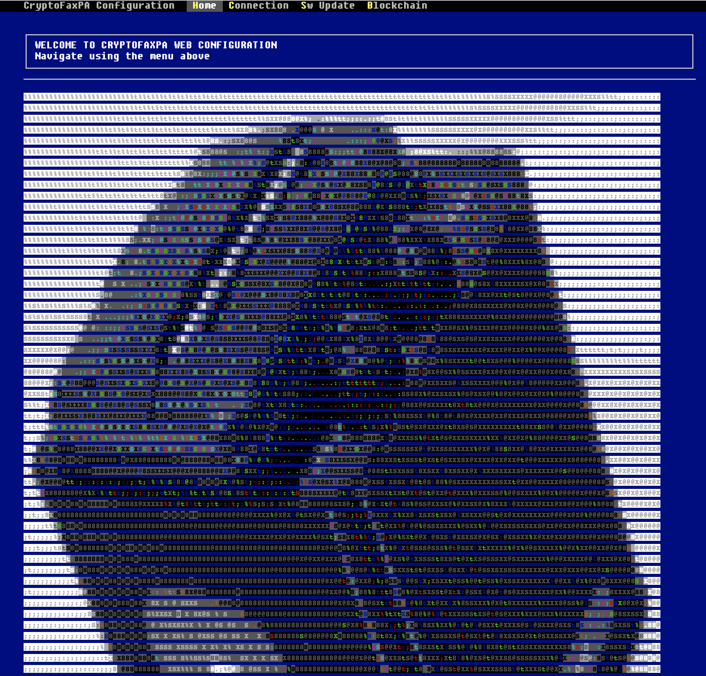
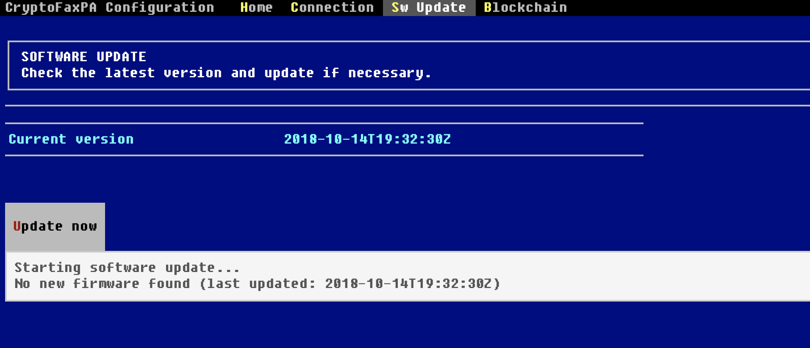
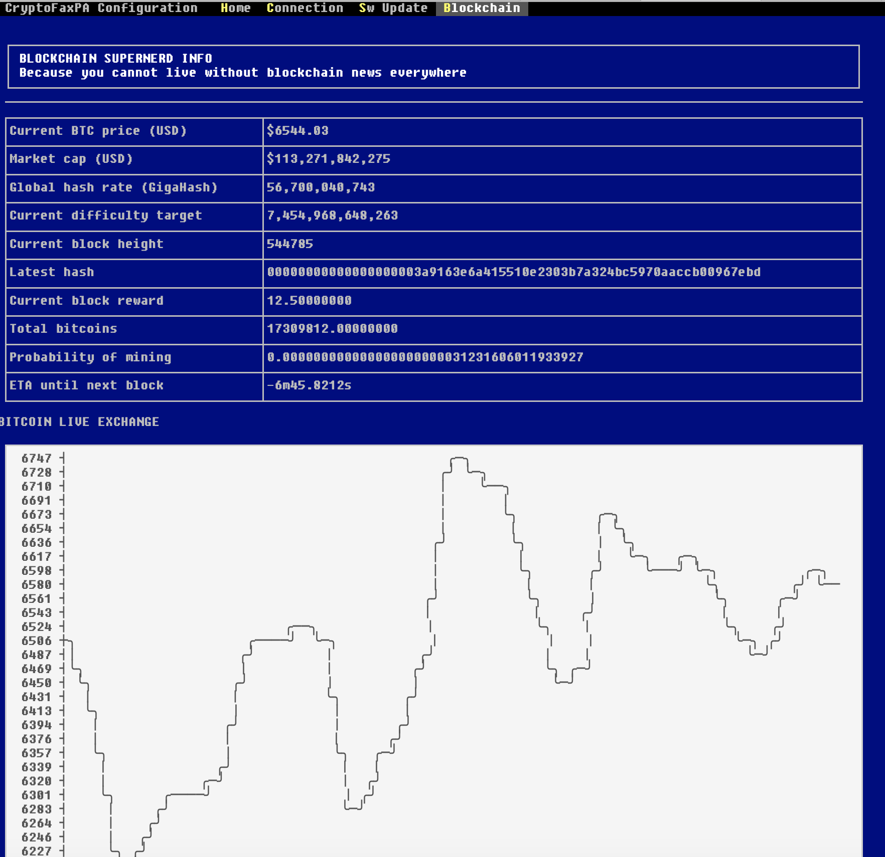
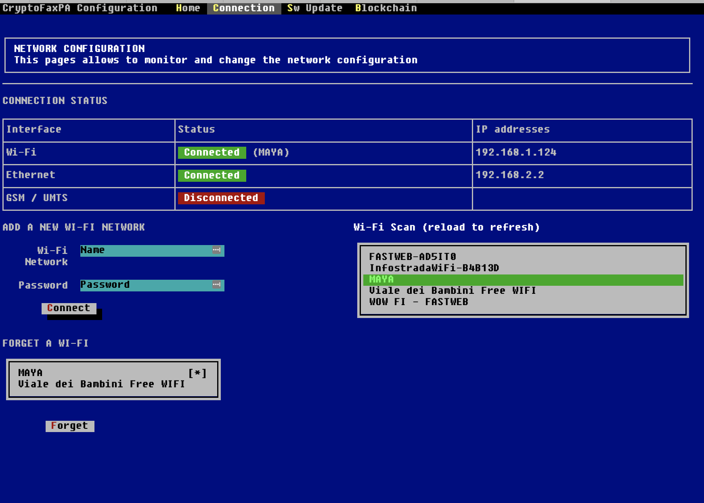

# CryptoFaxPA 2.0 📠

After the huge success of the [first model of CryptoFaxPa](https://teamdigitale.governo.it/upload/docs/2018/cryptofax-pa-it.pdf) officially launched on April, 1st 2018, a revamped and much more powerful version is now available. Yes, it's fully open source.

## Marketing pictures

## Configuration panel

## How it works

Plug it to a power socket and enjoy:

* GSM connection
* WiFi connection (whenever the HELP button is pressed, CryptoFaxPA will launch
  an access point that allows WiFi configuration)
* a HELP button which instantly prints installation instructions.
* a BLOCKCHAIN button which prints super-nerd blockchain information such as
  real-time Bitcoin value and other juicy things, along with a very pretty chart
* whenever a message is sent to the @CryptoFaxPA bot on Slack, it will be
  encrypted and sent to the device as a fax (actually, a cryptofax), and
  instantly printed
* while printing, a glorious 56k modem sound is emitted
* images are printed as well, and the Slack bot will actually show a
  preprocessed preview to the sender asking for confirmation - we don't want to
  send bad looking images
* in case a fax cannot be delivered to the device or printed successfully, it
  will be kept in spool

## Bill of materials:

* Raspberry PI 3 B+
* Pipsta thermal printer
* 2 push buttons (and 2 10kOhm resistors)
* PAM8302 audio amplifier
* Loudspeakers
* GSM USB modem (such as the Huawei E3531)

## Repository contents:

* [CryptoFaxPA_Leaflet_A3.pdf](CryptoFaxPA_Leaflet_A3.pdf): leaflet
* [CryptoFaxPA.scad](CryptoFaxPA.scad): 3D model
* [backend](backend): contains the bot that reacts to Slack messages and preprocesses them before adding them to a MQTT queue
* [client](client): contains the client that runs on the CryptoFaxPA device
* [common](common): contains common code shared by the other components
* [wificonf](wificonf): contains the WiFi configuration tool
* [overlay](overlay): contains the files to be replaced on a vanilla Raspbian Stretch

## Compilation

For the development cycle on the board, both `wificonf` and `client` have a
`deploy.sh` script that you can use to test (you might want to stop services
on the board using `systemctl stop cryptofaxpa` or `systemctl stop client`).

Backend development is a little hairy as there's currently no staging
environment. Assuming you have access to all production configuration keys,
you probably want to use `foreman` (or `goreman`) with `backend/Procfile.dev`,
after stopping the production instance.

## Software release

A release is cut by running `./release.sh` from the top-level. The release is
GPG-signed with a restricted set of authors (maintainers) and published as
release asset on GitHub. The CryptoFaxPA will auto-update checking for new
releases every hour (or can be manually triggered through the wificonf web
interface).

## Authors

* Giovanni Bajo (software)
* Laura Bordin (packaging & leaflet)
* Matteo De Santi (product design & packaging)
* Elisabetta Pique' (project manager)
* Alessandro Ranellucci (hardware & software)
